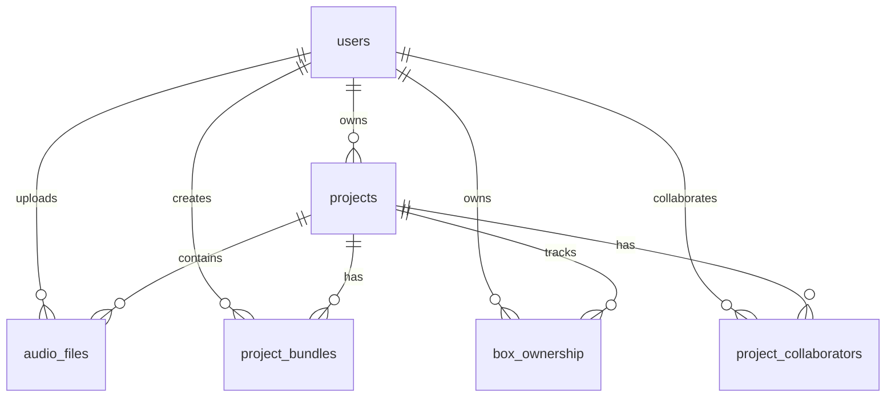

# SyncSphere Database Architecture

## Overview

SyncSphere uses PostgreSQL as its primary database, with multiple services connecting to it for different purposes. This document outlines the database architecture, service connections, configurations, and table structures.

## Service-Database Mapping

### 1. SyncSphere API Service
- **Port**: 8000
- **Database**: PostgreSQL
- **Connection**: Direct read/write access
- **Purpose**: Main API for project management, user authentication, and file storage

### 2. WebSocket Server
- **Port**: 8443 (WSS)
- **Database**: PostgreSQL
- **Connection**: Direct read/write access
- **Purpose**: Real-time collaboration features and track ownership management

### 3. OpenDAW Studio
- **Port**: 5173
- **Database**: No direct connection
- **Connection**: Via API calls to SyncSphere service
- **Purpose**: Frontend DAW application

## Database Configuration

### PostgreSQL Configuration
```yaml
Database Name: syncsphere
Host: localhost (in Docker: db)
Port: 5432
User: postgres
Password: postgres
```

### Docker Compose Configuration
```yaml
db:
  image: postgres:13
  environment:
    POSTGRES_USER: postgres
    POSTGRES_PASSWORD: postgres
    POSTGRES_DB: syncsphere
  ports:
    - "5432:5432"
  volumes:
    - postgres_data:/var/lib/postgresql/data
```

## Database Tables

### 1. `users` Table
Stores user account information.

| Column | Type | Constraints | Description |
|--------|------|-------------|-------------|
| id | SERIAL | PRIMARY KEY | Auto-incrementing user ID |
| username | VARCHAR(100) | UNIQUE, NOT NULL | Unique username |
| email | VARCHAR(255) | UNIQUE, NOT NULL | User email address |
| password_hash | VARCHAR(255) | NOT NULL | Bcrypt hashed password |
| created_at | TIMESTAMP | DEFAULT NOW() | Account creation time |
| updated_at | TIMESTAMP | DEFAULT NOW() | Last update time |

### 2. `projects` Table
Stores project metadata and configurations.

| Column | Type | Constraints | Description |
|--------|------|-------------|-------------|
| id | SERIAL | PRIMARY KEY | Auto-incrementing project ID |
| name | VARCHAR(255) | NOT NULL | Project name |
| description | TEXT | | Project description |
| owner_id | INTEGER | REFERENCES users(id) | Project owner |
| room_id | VARCHAR(100) | UNIQUE | Collaboration room identifier |
| is_public | BOOLEAN | DEFAULT false | Public visibility flag |
| created_at | TIMESTAMP | DEFAULT NOW() | Creation time |
| updated_at | TIMESTAMP | DEFAULT NOW() | Last update time |

### 3. `audio_files` Table
Stores metadata for uploaded audio files.

| Column | Type | Constraints | Description |
|--------|------|-------------|-------------|
| id | SERIAL | PRIMARY KEY | Auto-incrementing file ID |
| project_id | INTEGER | REFERENCES projects(id) ON DELETE CASCADE | Associated project |
| filename | VARCHAR(255) | NOT NULL | Original filename |
| file_path | VARCHAR(500) | NOT NULL | Storage path |
| file_size | BIGINT | | File size in bytes |
| duration | FLOAT | | Audio duration in seconds |
| sample_rate | INTEGER | | Sample rate (Hz) |
| channels | INTEGER | | Number of audio channels |
| format | VARCHAR(50) | | Audio format (wav, mp3, etc.) |
| uploaded_by | INTEGER | REFERENCES users(id) | Uploader user ID |
| created_at | TIMESTAMP | DEFAULT NOW() | Upload time |

### 4. `project_bundles` Table
Stores project bundle files (.odb format).

| Column | Type | Constraints | Description |
|--------|------|-------------|-------------|
| id | SERIAL | PRIMARY KEY | Auto-incrementing bundle ID |
| project_id | INTEGER | REFERENCES projects(id) ON DELETE CASCADE | Associated project |
| bundle_data | BYTEA | NOT NULL | Binary bundle data |
| version | INTEGER | DEFAULT 1 | Bundle version number |
| created_by | INTEGER | REFERENCES users(id) | Creator user ID |
| created_at | TIMESTAMP | DEFAULT NOW() | Creation time |

### 5. `box_ownership` Table
Tracks ownership of tracks/boxes for collaboration permissions.

| Column | Type | Constraints | Description |
|--------|------|-------------|-------------|
| id | SERIAL | PRIMARY KEY | Auto-incrementing ID |
| project_id | INTEGER | REFERENCES projects(id) ON DELETE CASCADE | Associated project |
| box_uuid | UUID | NOT NULL | Track/Box UUID |
| track_index | INTEGER | | Track index in timeline |
| owner_id | INTEGER | REFERENCES users(id) | Owner user ID |
| created_at | TIMESTAMP | DEFAULT NOW() | Creation time |
| updated_at | TIMESTAMP | DEFAULT NOW() | Last update time |

**Indexes**:
- `idx_box_ownership_project_uuid` ON (project_id, box_uuid)
- `idx_box_ownership_project_index` ON (project_id, track_index)

### 6. `project_collaborators` Table
Manages project collaboration permissions.

| Column | Type | Constraints | Description |
|--------|------|-------------|-------------|
| id | SERIAL | PRIMARY KEY | Auto-incrementing ID |
| project_id | INTEGER | REFERENCES projects(id) ON DELETE CASCADE | Associated project |
| user_id | INTEGER | REFERENCES users(id) ON DELETE CASCADE | Collaborator user ID |
| role | VARCHAR(50) | DEFAULT 'editor' | User role (owner, editor, viewer) |
| joined_at | TIMESTAMP | DEFAULT NOW() | Join time |

**Indexes**:
- `idx_project_collaborators_unique` UNIQUE ON (project_id, user_id)

## Database Relationships



## Service Database Access Patterns

### SyncSphere API Service
- **User Management**: CRUD operations on `users` table
- **Project Management**: CRUD operations on `projects`, `project_collaborators`
- **File Management**: CRUD operations on `audio_files`
- **Bundle Management**: Read/write to `project_bundles`

### WebSocket Server
- **Real-time Sync**: Reads from `projects`, `project_bundles`
- **Ownership Tracking**: Read/write to `box_ownership`
- **Collaboration**: Reads from `project_collaborators` for permissions

### Database Connection Pooling

Both services use connection pooling for efficient database access:

```python
# SyncSphere Service (FastAPI)
DATABASE_URL = "postgresql://postgres:postgres@db:5432/syncsphere"
engine = create_engine(DATABASE_URL, pool_size=20, max_overflow=40)

# WebSocket Server
db_config = {
    'host': 'localhost',
    'database': 'syncsphere',
    'user': 'postgres',
    'password': 'postgres',
    'min_size': 10,
    'max_size': 20
}
```

## Migration Management

Database migrations are handled using Alembic:

```bash
# Create new migration
alembic revision --autogenerate -m "Description"

# Apply migrations
alembic upgrade head

# Rollback
alembic downgrade -1
```

## Backup Strategy

1. **Automated Daily Backups**: PostgreSQL dumps at 2 AM
2. **Project Bundle Versioning**: Each save creates a new version
3. **Audio File Storage**: Separate file system backup for audio files

## Performance Considerations

1. **Indexes**: Strategic indexes on foreign keys and frequently queried columns
2. **Connection Pooling**: Prevents connection exhaustion
3. **Cascade Deletes**: Automatic cleanup of related records
4. **BYTEA Storage**: Efficient binary storage for project bundles

## Security Measures

1. **Password Hashing**: Bcrypt for user passwords
2. **SQL Injection Prevention**: Parameterized queries via SQLAlchemy
3. **Connection Encryption**: SSL/TLS for database connections in production
4. **Access Control**: Role-based permissions via `project_collaborators`

## Future Considerations

1. **Sharding**: Potential horizontal scaling for large user bases
2. **Read Replicas**: For read-heavy workloads
3. **Time-series Data**: Consider separate storage for real-time collaboration events
4. **Caching Layer**: Redis for frequently accessed data 